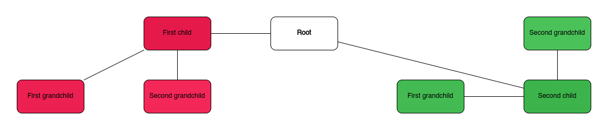

# DioMindmap

DioMindmap allows you to create [Draw.io](https://app.diagrams.net/) mind map diagrams in a simple and intuitive way.

Given a simple indented text file like this:

```text
Root
    First child
        First grandchild
        Second grandchild
    Second child
        First grandchild
        Second grandchild
```

The following diagram will be generated (in Draw.io compatible XML format):



## Installation

```bash
pipx install diomindmap
```

## Usage

```bash
diomindmap generate -i <input_file> -o <output_file>
```

Use `diomindmap generate --help` for more information on command line arguments.

### Input file format

The input file is a simple text file that uses indentation to define the hierarchy of the mind map. The indentation
can be either spaces or tabs, but must be consistent throughout the file.

The file may contain multiple root nodes, for example:

```text
Root 1
    First child
        First grandchild
Root 2
    First child
```

In this case each root node will be rendered as a separate tab within Draw.io.

## Implementation details

- The project structure is managed with [Projen](http://projen.io/python.html).
- [Poetry](https://python-poetry.org/) is used for dependency management (integration with Projen).
- [Typer](https://typer.tiangolo.com/) is used for CLI related functionality.
- [N2G](https://pypi.org/project/n2g/) is used to generate the Draw.io compatible XML file.

## Maintenance and contributing

You are welcome to contribute to this project, but please note that I will not necessarily have time review and merge  
pull requests. I created this project to do one simple thing, and it does that well enough for my purposes.

I don't currently plan to add any new features. If you would like to take this further, please consider forking the
project.

### Ideas

Even though I don't plan on any new features, the following ideas might be worth considering:

- Support passing the layout algorithm as an argument.
- Support directories / glob patterns as input to batch process an entire directory of input files.
- Write tests.
- Add GitHub actions to run build the project and publish to PyPi.
- Is there a way to directly open the generated XML file in Draw.io?

## License

MIT License

Copyright (c) [2023] [Anrich van Schalkwyk]

Permission is hereby granted, free of charge, to any person obtaining a copy
of this software and associated documentation files (the "Software"), to deal
in the Software without restriction, including without limitation the rights
to use, copy, modify, merge, publish, distribute, sublicense, and/or sell
copies of the Software, and to permit persons to whom the Software is
furnished to do so, subject to the following conditions:

The above copyright notice and this permission notice shall be included in all
copies or substantial portions of the Software.

THE SOFTWARE IS PROVIDED "AS IS", WITHOUT WARRANTY OF ANY KIND, EXPRESS OR
IMPLIED, INCLUDING BUT NOT LIMITED TO THE WARRANTIES OF MERCHANTABILITY,
FITNESS FOR A PARTICULAR PURPOSE AND NONINFRINGEMENT. IN NO EVENT SHALL THE
AUTHORS OR COPYRIGHT HOLDERS BE LIABLE FOR ANY CLAIM, DAMAGES OR OTHER
LIABILITY, WHETHER IN AN ACTION OF CONTRACT, TORT OR OTHERWISE, ARISING FROM,
OUT OF OR IN CONNECTION WITH THE SOFTWARE OR THE USE OR OTHER DEALINGS IN THE
SOFTWARE.

